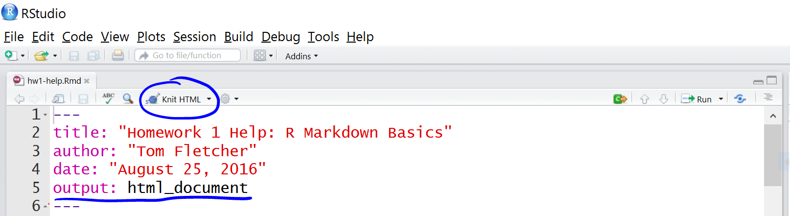

<link href="https://fonts.googleapis.com/css?family=Roboto|Source+Sans+Pro:300,400,600|Ubuntu+Mono&amp;subset=latin-ext" rel="stylesheet">

```{r,include=FALSE,eval=knitr::opts_knit$get("rmarkdown.pandoc.to")=="html"}
# Enables Font Awesome in HTML based bookdown outputs.
fa <- rmarkdown::html_dependency_font_awesome()
fa$attachment <- "fonts/fontawesome-webfont.ttf"
htmltools::tagList(fa)
```

```{r,eval=TRUE,include=FALSE}
# load libraries
library(knitr) # runs pandoc
library(bookdown) # for markdown
library(captioner) # for table and figure captions

# prepare captions
tc <- captioner::captioner(prefix="<b>Tab. </b>")
fc <- captioner::captioner(prefix="<b>Fig. </b>")

# knitr options

knitr::opts_knit$set(progress=TRUE,verbose=TRUE)
knitr::opts_chunk$set(dev="svg",results="hold",fig.show="hold",fig.align="left",
                      echo=TRUE,warning=FALSE,message=FALSE,accordion=NULL,
                      block.title=NULL)
```

```{r,include=FALSE,cache=FALSE}
# custom hooks
## collapsible panel
knitr::knit_hooks$set(accordion=function(before,options,envir) {
  if(before) {
    id <- paste0("acc",format(Sys.time(),"%Y%m%d%H%S"),sample(c(0:9),1),sample(c(0:9),1),sample(c(0:9),1),sample(c(0:9),1))
    if(is.null(options$btntype)) {btntype <- "normal"}else{btntype <- options$btntype}
    paste0('<p>',
          '<button class="btn btn-sm btn-primary btn-collapse btn-collapse-',btntype,' collapsed" type="button" data-toggle="collapse" data-target="#',id,'" aria-expanded="false" aria-controls="',id,'">',
          '</button>',
          '</p>',
          '<div class="collapse" id="',id,'">',
          '<div class="card card-body">')
  }else{
    paste0("</div>","</div>")
  }
})

## show title for code
knitr::knit_hooks$set(block.title=function(before,options,envir) {

out_class <- NULL
if(is.null(options$class.output)) {
if(options$echo) out_class <- options$engine
if((!options$echo) & (options$results != "hide")) out_class <- "Output"
}else{
  out_class <- options$class.output
}

  if(before) {
    paste0('<div class="block-title-parent"><div class="block-title small">',out_class,'</div>')
  }else{
    paste0('</div>')
  }
})
```

<h3 class="author">`r paste0('<b>Roy Francis</b> • ',format(Sys.Date(),format='%d-%b-%Y'))`</h3>


<br>
<br>

# Topics

This tutorial aims to get you started with R. It roughly covers the following topics:

- R & RStudio environment
- Running code, scripting, sourcing script
- Variables and operators
- Data types & data type conversion
- Reusing code using functions
- Base and grid graphics
- Input & output of text & graphics
- Reproducible analyses, Rmarkdown, notebooks and reports
- Tidyverse: Modern R programming paradigm

# What? Why R?

This is the definition provided by [R-Project](https://www.r-project.org/about.html).

> R is a language and environment for statistical computing and graphics.

**Pros**

- Data analysis
- Statistics
- High quality graphics
- Huge number of packages
- R is popular
- Reproducible research
- RStudio IDE
- FREE! Open source

**Cons**

- Steep learning curve
- Not elegant/consistent
- Slow

# Getting started

R can be installed from [r-project.org](https://cloud.r-project.org/) for Windows, Mac or Linux operating systems. It is also necessary to install Rtools from [here](https://cran.r-project.org/bin/) for building packages from source when installing new packages.

RStudio is one of the best IDE (Integrated development environment) out there for any language. Download [here](https://www.rstudio.com/products/rstudio/download/) for Windows, Mac or Linux. Rstudio provides you with an environment for organising your R projects, files and outputs. You also get debugging tools and GUI interfaces to common basic operations.


R commands are excecuted and results and returned in the **Console**. The **Console** shows a `>` symbol meaning that it is ready to accept commands. When it is waiting for further information, it shows a `+` symbol. This can happen when you have pasted in partial command or forgot to close parenthesis etc. Provide the required information, complete the command or press <kbd>Esc</kbd> on the keyboard to exit from the `+` back to the `>`.

Run a command in the R console.

```{r,eval=FALSE}
getwd()
```

This command prints the current working directory. When you read or write, this is the path that R looks for.

Commands written in the **Console** are executed and lost. R commands can be saved as a script. To create a new script, go to **File > New File > R Script**. This text file can be saved to the working directory named **script.R**. Now add some R command to the file. For example try;

```{r}
date()
```

While in an R script, select the text or place the cursor on that line and click **Run**. Alternatively use keyboard shortcut <kbd>Ctrl</kbd>+<kbd>Enter</kbd> / <kbd>Command</kbd>+<kbd>Enter</kbd>.

`date()` prints the current system date. Or you could try `SessionInfo()` which gives you a summary of the current system setup including R version, operating system and R packages that are loaded/attached.

Then save the file as, for example **script.R**. All commands in the saved **script.R** can be run as a batch either by selecting all the commands followed by **Run** / <kbd>Ctrl</kbd>+<kbd>Enter</kbd>, or directly sourcing the file from the console like this:

`source("script.R")`

# Variables & Operators

Variables are used to store values. Variables can store many different kinds of data as will be covered under data types. Variables can be pretty much any string. When creating variables, it is important that they do not override existing variable or function names and this can create issues further on.

- Avoid conflicting variable names like `c`, `t` etc
- Variable names cannot start with a number

## Basic Operators

Variables are assigned usually using the `<-` operator. The `=` operator also works in a similar way for most part.

```{r}
x <- 4
x = 4
x
```

The commonly used arithmetic operators are shown below returning a number.

```{r}
x <- 4
y <- 2

# add
x + y

# subtract
x - y

# multiply
x * y

# divide (get quotient after division)
x / y

# modulus (get reminder after division)
x %% y

# power
x ^ y
```

## Logical Operators

Logical operators return a logical `TRUE` or `FALSE`.

```{r}
# equal to?
x == y

# not equal to?
x != y

# greater than?
x > y

# less than?
x < y

# greater than or equal to?
x >= y

# less than or equal to?
x <= y
```

The OR operator `|` and the AND operator `&` is useful when dealing with logical statements.

```{r}
(x > y) | (y < x)
(x > y) & (y < x)
```

`|` and `&` are vectorised which means it can be applied to two logical vectors. Each pair is compared and a result is produced for each element. The result is a vector.

```{r}
c(F,F,F,T,F,F) | c(F,F,F,F,F,F)
```

Now, there are also two variants `||` and `&&`. These operators compare left to right element-wise and stop after the first element. Consider the same example above replacing `|` with `||`. The result is one element and not a vector.

```{r}
c(F,F,F,T,F,F) || c(F,F,F,F,F,F)
```

The `||` operator may not be always desirable as it only compares the first element in both vectors to return the result.

```{r}
c(F,F,F,T,F,F) | c(F,F,F,F,NA,F)
c(F,F,F,T,F,F) || c(F,F,F,F,NA,F)
```

The longer operators also only evaluate as many terms as needed (short-circuiting). A positive side-effect of this is that if some of elements are `NULL`, it still returns a result.

```{r}
T | NULL
T || NULL
```

In the second case, the first part was `TRUE`, so it did not evaluate the second part which is a `NULL`. But if `&&` was used, it will have to evaluate both sides and that would return an error.

In practice, the long operators are not commonly used.  A better practice is to use `any()` and `all()` to evaluate logical vectors to a single logical.

```{r}
# are any of these true?
any(c(F,F,F,T,F,F))
```

```{r}
# are all of these true?
all(c(F,F,F,T,F,F))
```

Characters/strings can be assigned to variables in a similar manner.

```{r}
z <- "this"
z1 <- "that"
paste(z,z1)
```

The function `paste()` concatenates strings.

Variables names must be selected such that they do not conflict with existing variables/functions. For example, variable name `c` must be avoided as it is an existing function to concatenate R objects. The variable name `t` must be avoided as it is a function to transpose a matrix. Variable names must not start with a number.

## Other Operators

Here are some other commonly used operators. `:` is used generate a sequence.

```{r}
1:10
```

`%in%` is a set operator. `"a" %in% c("x","p","a","c")` checks if `a` is a member of the set `x,p,a,c`.

```{r}
"a" %in% c("x","p","a","c")
```

The reverse would also work, but the number of returned elemnts are now different.

```{r}
c("x","p","a","c") %in% "a"
```

And here are some operators that are not so commonly used.

`::` is used to access a function explicitly from a specific package. When you normally call a function, say `sum()`, R searches the namespace and finds it. In case, there is a function `sum()` from another package, the last loaded package overrides the previous function. In cases like this or to be absolutely sure that you are using the correct function from the correct package, you can use `package::function()` to call a function. For example; `base::sum()`. `:::` is used to call functions from a package that are not "exported". This is rarely used.

`%*%` is used for matrix multiplication.

```{r}
matrix(c(2,2,3,3),nrow=2) %*% matrix(c(4,2,5,3),nrow=2)
matrix(c(2,2,3,3),nrow=2) %*% c(6,6)
```

<div class="instruction">

<b><i class="fas fa-clipboard-list"></i> Challenge</b>

Can you write the code to find and print even numbers from a vector of numbers, say 1 to 10? The output being `2 4 6 8 10`. *Click below to reveal the code.*

<p>
<button class="btn btn-sm btn-primary btn-collapse btn-collapse-normal collapsed" type="button" data-toggle="collapse" data-target="#task-operators" aria-expanded="false" aria-controls="task-operators">
</button>
</p>
<div class="collapse" id="task-operators">
<div class="card card-body">

```{r}
x <- c(1:10)
y <- x %% 2
z <- y==0
x[z]
```

<i class="fas fa-lightbulb"></i> More explanation?

`c(1:10)`creates a vectors of numbers 1 to 10. `x %% 2` gets the modulus of these numbers (ie; divide by 2 and get the reminder). `y==0` checks if the reminders are zero. Returns a `TRUE` if it's zero or a `FALSE` if not. `z` is now a logical vector. `z` can be used to index `x`. `x[z]` returns values of x that are true.

This can all be written in one line as well `c(1:10)[c(c(1:10) %% 2)==0]`.

</div>
</div>
</div>

# Data Types

## Overview

Overview of data structures in R

```{r,echo=FALSE}
data.frame(dimension=c("1D","2D","nD"),homogenous=c("Atomic vector","Matrix","Array"),heterogenous=c("List","Dataframe",""))
```

R data object that have a single type of data are referred to as homogenous data type. These are also called atomic types. Heterogenous objects have mixed data types.

## Homogenous data

### Basic

The mode of a variable is inspected using the function `mode()`. Here we can see some of the basic data objects in R.

```{r}
mode(1.0)
mode(1L)
mode("hello")
mode(factor(1))
mode(T)
```

Factors are explained further below. The type of a variable can be inspected using the function `typeof()`.

```{r}
typeof(1.0)
typeof(1L)
typeof("hello")
typeof(factor(1))
typeof(T)
```

Other useful functions for inspecting R objects.

```{r}
class(x)
str(x)
structure(x)
```

### Vectors

Vectors store multiple values. Multiple values, variables and vectors are concatenated together using the function `c()`.

```{r}
x <- c(2,3,4,5,6)
y <- c("a","c","d","e")
x
y
```

There are different ways to create vectors. Here are a few:

```{r}
c(2,3,5,6)
2:8
seq(2,5,by=0.5)
rep(1:3,times=2)
rep(1:3,each=2)
```

R uses 1-based indexing system and a specific value from a specific location in the vector is accessed using the `[]` operator.

```{r}
x[1]
y[3]
```

The `c()` function can be used to specify multiple positions.

```{r}
x[c(1,3)]
```

The above vector is 1-dimensional and composed of the same data type (homogenous). Such vectors are referred to as atomic vectors.

```{r}
mode(x)
mode(y)

str(x)
str(y)
```

Vectors can be added or concatenated directly. This is referred to as a vectorised operation, a crucial concept in R.

```{r}
x <- c(2,3,4,5)
y <- c(9,8,7,6)
x+y

z <- c("a","an","a","a")
k <- c("boy","apple","girl","mess")
paste(z,k)
```

Verify if an R object is atomic (contains a single data type).

```{r}
is.atomic(x)
```

```{r}
is.numeric(x)
is.character(z)
```

A vector of logical type is called a logical vector.

```{r}
x <- c(T,F,T,T)
is.logical(x)
```

Vectorised logical operations can be performed on logical vectors.

```{r}
c(F,T,F,F) | c(F,F,F,F)
c(F,T,F,F) & c(F,F,F,F)
```

Vectors can be named if required.

```{r}
x <- c("a"=2,"b"=3,"c"=8)
x
```

Named vectors can be subsetted using the name.

```{r}
x["c"]
```

### Factors

Factors are vectors that store categorical data.

```{r}
x <- factor(c("a","b","b","c","c"))
x
class(x)
str(x)
```

Factor 'x' has 3 categories or in R speak; 3 levels.

```{r}
levels(x)
```

The levels are ordered automatically in alphabetical order as seen above. The order can be manually set.

```{r}
factor(c("a","b","b","c","c"),levels=c("b","a","c"))
```

Verify if an R object is a factor.

```{r}
is.factor(x)
```

### Matrix

Vectors can be assembled into a matrix data structure.

```{r}
x <- matrix(c(2,3,4,5,6,7))
x
```

A matrix is a 2D data structure with rows and columns.

```{r}
# dimensions
dim(x)

# number of rows
nrow(x)

# number of columns
ncol(x)
```

The number of rows and columns can be specified when building the matrix. The matrix can be filled up row-wise (`byrow=T`) or colum-wise (`byrow=F`).

```{r}
x <- matrix(c(2,3,4,5,6,7),nrow=3,ncol=2,byrow=TRUE)
x
```

```{r}
str(x)
```

Verify if an R object is a matrix.

```{r}
is.matrix(x)
```

Matrix positions can be accessed using the `[]` operator by specifying the row and column `[row,col]`.

```{r}
x[2,2]
```

A whole row or a column can be accessed by `[row,]` or `[,col]`.

```{r}
x[1,]
x[,2]
```

Notice that this automatically creates a vector. The matrix data type can be retained by specifying `drop=FALSE`.

```{r}
x[1,,drop=F]
x[,2,drop=F]
```

Column names and row names can be added to matrices.

```{r}
rownames(x) <- c("a","b","c")
colnames(x) <- c("k","p")
```

Then the matrix can be accessed using these labels.

```{r}
x["b",]
x[,"p"]
```

<div class="instruction">

<b><i class="fas fa-clipboard-list"></i> Challenge</b>

If I create a vector as follows `x <-c(5,3,9,"6")`, what is the "type" of the element in the third position? Is it a number?

<p>
<button class="btn btn-sm btn-primary btn-collapse btn-collapse-normal collapsed" type="button" data-toggle="collapse" data-target="#task-vectors" aria-expanded="false" aria-controls="task-vectors">
</button>
</p>
<div class="collapse" id="task-vectors">
<div class="card card-body">

```{r}
x <-c(5,3,9,"6")
typeof(x[3])
```

<i class="fas fa-lightbulb"></i> The third position is not a number, it's a character. In fact, all elements in this vector are characters. If there is a character in a numeric vector, all elements are converted to characters (`typeof(x)`).

</div>
</div>
</div>

<div class="instruction">
<b><i class="fas fa-clipboard-list"></i> Challenge</b>

Create the matrix shown below and extract the third column as a vector.

```{r,echo=FALSE}
matrix(c(2,3,4,5,2,7,6,6,6),nrow=3,byrow=T)
```

<p>
<button class="btn btn-sm btn-primary btn-collapse btn-collapse-normal collapsed" type="button" data-toggle="collapse" data-target="#task-matrix" aria-expanded="false" aria-controls="task-matrix">
</button>
</p>
<div class="collapse" id="task-matrix">
<div class="card card-body">

```{r}
# either this
x <- matrix(c(2,3,4,5,2,7,6,6,6),nrow=3,byrow=T)
# or this
x <- matrix(c(2,5,6,3,2,6,4,7,6),nrow=3,byrow=F)
x
```

```{r}
# access third column
x[,3]
```

</div>
</div>
</div>

## Heterogenous data

### Lists

List elements can be mixed data type and is built using `list()` rather than `c()`.

```{r}
x <- list(c(2,3,4,5),c("a","b","c","d"),factor(c("a","a","b")),
          matrix(c(3,2,3,5,6,7),ncol=2))
x
```

```{r}
typeof(x)
class(x)
```

```{r}
str(x)
```

Lists are recursive as there can be lists inside lists.

```{r}
str(list(list(list(list()))))
```

Verify if an R object is a list.

```{r}
is.list(x)
```

List are accessed using `[]` and `[[]]`. `[]` returns a list while `[[]]` returns the object inside the list.

```{r}
x[1]
```

```{r}
x[1:2]
class(x[1:2])
```

```{r}
x[[4]]
class(x[[4]])
```

List items can also be named. Let's add a list into our list.

```{r}
x$newlist <- list(c(500,600,700))
x
```

Lists can be accessed by the name.

```{r}
x$newlist
```

Use `unlist()` to remove the list structure.

```{r}
unlist(x$newlist)
```

### data.frame

data.frames are the most common way to store data in R. dataframes are basically lists of equal-length vectors. Like matrices, dataframe 2D with rows and columns. data.frames are created using the function `data.frame()`. The most important difference between a matrix and a data.frame is that matrices are atomic (contains data of one type) while data.frames can contain a mix of numeric columns, characters, factors, logicals etc.

```{r,results="markup"}
dfr <- data.frame(x = 1:3, y = c("a", "b", "c"))
print(dfr)
```

Notice that we have named the columns as 'x' and 'y'.

```{r}
str(dfr)
```

Notice that column 'y' has been automatically converted to a factor. This is the root of a lot of issues for new R users. It is best to avoid the automatic conversion by setting `stringsAsFactors=FALSE`.

```{r}
dfr <- data.frame(x = 1:3, y = c("a", "b", "c"), stringsAsFactors = F)
str(dfr)
```

Verify if an R object is a 'data.frame'.

```{r}
is.data.frame(dfr)
```

Accessing positions in a data.frame is similar to matrices. In addition, the `$` operator is also commonly used to access a column.

```{r}
dfr$x
dfr$y
```

Subset a `data.frame()` conditionally.

```{r,results="markup"}
print(subset(dfr,dfr$y=="a"))
```

Get column names and row names of a data.frame

```{r}
colnames(dfr)
rownames(dfr)
```

Ordering a dataframe by one column in decreasing order.

```{r,results="markup"}
print(dfr[order(dfr$y,decreasing=T),])
```

## Type conversion

Several functions are available to convert R objects from one type to another.

```{r}
x <- c(1,2,3)
str(x)
```

```{r}
y <- as.character(x)
str(y)
```

The numeric vector has been converted to a character vector. Similarly, character can be coerced (if possible) into numbers.

```{r}
x <- c("1","2","hello")
str(x)
```

```{r}
str(as.numeric(x))
```

Notice that characters that cannot be converted to a valid number is converted to NA along with a warning message.

<div class="instruction">
<b><i class="fas fa-clipboard-list"></i> Challenge</b>

Here is a data.frame inside a list which is inside a list. How do you extract the *Species* column as a vector?

```{r,echo=FALSE}
x <- list(list(head(iris)))
str(x)
```

<p>
<button class="btn btn-sm btn-primary btn-collapse btn-collapse-normal collapsed" type="button" data-toggle="collapse" data-target="#task-dfr" aria-expanded="false" aria-controls="task-dfr">
</button>
</p>
<div class="collapse" id="task-dfr">
<div class="card card-body">

```{r}
x <- list(list(head(iris)))
# either this
x[[1]][[1]]$Species
# or this
x[[1]][[1]][,5]
```

`[]` access a list but still returns a list. `[[]]` returns the object inside a list.

</div>
</div>
</div>

# Functions

Functions are chunks of code packaged into reusable units. We have used many functions in the previous sections such as `c()`, `str()`, `is.list()`, `typeof()` etc.

## Built-In

Functions that come with the base R installation are referred to as built-in functions or base functions. R has loads of built-in functions for various applications such as data analysis, programming, math, plotting etc. Additional functions can be made available by installing external packages.

Below are some functions that can be applied to numeric data:

```{r}
# generate 10 random numbers between 1 and 200
x <- sample(x=1:200,10)

# length
length(x)

# sum
sum(x)

# mean
mean(x)

# median
median(x)

# min
min(x)

# log
log(x)

# exponent
exp(x)

# square-root
sqrt(x)

# round
round(x)

# sort
sort(x)
```

Some useful string functions.

```{r}
a <- "sunny"
b <- "day"

# join
paste(a, b)

# find a pattern
grep("sun", a)

# number of characters
nchar("sunny")

# to uppercase
toupper("sunny")

# to lowercase
tolower("SUNNY")

# replace pattern
sub("sun", "fun", "sunny")

# substring
substr("sunny", start=1, stop=3)
```

Some general functions

```{r}
print("hello")
print("world")
cat("hello")
cat(" world")
cat("\nhello\nworld")
```

## Custom

If you see yourself copy-pasting a chunk of R code many times, then it is probably a good idea to create a function out of it.

Let's say you have two vectors that you would like to perform a series of operations on and then output a result.

```{r}
a <- 1:6
b <- 8:10

d <- a*b
e <- log(d)
f <- sqrt(e)
f
```

You can modify this code block into a function as follows:

```{r}
my_function <- function(a, b){
  d <- a*b
  e <- log(d)
  f <- sqrt(e)
  return(f)
}
```

Once defined, you can use this wherever needed.

```{r}
my_function(a=2:4, b=6:8)
```

**a** and **b** are called arguments or parameters to the function. If they are explicity written, then the position defines which parameter they are.

```{r}
# this
my_function(a=2:4, b=6:8)
# is the same as this
my_function(b=2:4, a=6:8)
# and the same as this
my_function(2:4, 6:8)
```

In this case `my_function(2:4,6:8)`, argument **a** is `2:4` and argument **b** is `6:8`. In this case `my_function(6:8,2:4)`, argument **a** is `6:8` and argument **b** is `2:4`.

Variables defined within a function are only available within that function and not available outside that function unless returned.

```{r,error=TRUE}
my_new_function <- function(a) {
  varz <- a + 2
  return(varz)
}

my_new_function(5)

print(varz)
```

In the above function, variable `varz` created inside the function is not available outside of that function.

But the reverse is possible.

```{r}
my_new_function <- function() {
  varz <- foo + 2
  return(varz)
}

foo <- 55
my_new_function()
```

In the example above, variable `foo` used inside the function is not supplied to the function through an argument, yet it still manages to find it. When a function doesn't find a variable inside a function, it searches outside the function.

<div class="instruction">
<b><i class="fas fa-clipboard-list"></i> Challenge</b>

R lacks a function to compute coefficient of variation (COV). Create a function to compute the COV. And use the function to compute the COV of these set of values: `c(4,7,2,3,5,4,3)`. The formula for COV is `cov=sd/mean`. Remember to NOT use `cov` as the function name because it already exists (`?cov`). It stands for covariance. So, use another function name.

<p>
<button class="btn btn-sm btn-primary btn-collapse btn-collapse-normal collapsed" type="button" data-toggle="collapse" data-target="#task-cov" aria-expanded="false" aria-controls="task-cov">
</button>
</p>
<div class="collapse" id="task-cov">
<div class="card card-body">

```{r}
covfefe <- function(x) sd(x)/mean(x)
covfefe(c(4,7,2,3,5,4,3))
```

</div>
</div>
</div>

# Control Structures

Conditional statements are written using `if()`.

```{r}
a <- 2
b <- 5

if(a < b) print(paste(a,"is smaller than",b))
```

`else` is used to add an alternative output.

```{r}
a <- 2
b <- 5

if(a < b) {
  print(paste(a,"is smaller than",b))
}else{
  print(paste(b,"is smaller than",a))
}

a <- 60
b <- 10

if(a < b) {
  print(paste(a,"is smaller than",b))
}else{
  print(paste(b,"is smaller than",a))
}
```

`if else` statements can be chained together:

```{r}
grade <- "B"

if(grade == "A"){
  print("Grade is Excellent!")
}else if(grade == "B"){
  print("Grade is Good.")
} else if (grade == "C") {
  print("Grade is Alright.")
}
```

This is not to be confused with a function called `ifelse()`. This is also used for conditional selection and takes the form `ifelse(test, return-if-yes, return-if-no)`, and this is vectorised. So, for example, here are some ages of persons. Classify them as adults or juveniles.

```{r}
x <- c(6,23,12,10,56,44)
ifelse(x>18,"Adult","Juvenile")
```

The `for()` loop is useful to run commands repeatedly over a known number of iterations.

```{r}
for (i in 1:5){
  print(i)
}
```

The `while()` loop is useful to run commands repeatedly for an unknown number of iterations until a condition is satisfied.

```{r}
i <- 1
while(i < 5){
  print(i)
  i <- i+1
}
```

<div class="instruction">
<b><i class="fas fa-clipboard-list"></i> Challenge</b>

Below is a [Floyd's triangle](https://en.wikipedia.org/wiki/Floyd%27s_triangle). This is right-angled triangle where the number of elements in each row is the same as the row number. And the numbers increase consecutively top to bottom. For a given number of rows, can you write the code using control structures to generate this result?

<i class="fas fa-lightbulb"></i> The function `cat()` can be used to print text without a new line (ie; in the same line). `cat("\n")` adds a new line.

```{r,echo=FALSE,comment=""}
rows <- 5
n <- 1
for(i in 1:rows) {
  for(j in 1:i) {
    cat(n,"")
    n <- n+1
  }
  cat("\n")
}
```

<p>
<button class="btn btn-sm btn-primary btn-collapse btn-collapse-normal collapsed" type="button" data-toggle="collapse" data-target="#task-control" aria-expanded="false" aria-controls="task-control">
</button>
</p>
<div class="collapse" id="task-control">
<div class="card card-body">

```{r}
rows <- 5
n <- 1
for(i in 1:rows) {
  for(j in 1:i) {
    cat(paste0(n," "))
    n <- n+1
  }
  cat("\n")
}
```

This is one way to do it. This is called a nested for-loop. The variable `n` carries the actual value to be printed. It is incremented everytime it is printed (`n <- n+1`). Variable `i` keeps track of rows. Variable `j` keeps track of elements on each row. After all elements on a row has been printed, control exits the `j` loop and `cat("\n")` creates a new line.

</div>
</div>
</div>

# R packages

R packages extend the functionality of base R. R packages are stored in repositories of which the most commonly used is called [CRAN](https://cran.r-project.org/) (The Comprehensive R Archive Network).

Packages are installed using the function `install.packages()`. Let's install the graphics and plotting package `ggplot2` which will be useful in later sections.

```{r,eval=FALSE}
install.packages("ggplot2",dependencies=TRUE)
```

Packages can also be installed from a local zipped file by providing a local path ans setting `type="source"`.

```{r,eval=FALSE}
install.packages("./dir/package.zip",type="source")
```

Inside RStudio, installing packages is much easier. Go to the **Packages** tab and click **Install**. In the window that opens up, you can find your package by typing into the **Packages** field and clicking **Install**.


Packages on GitHub can be installed using the function `install_github()` from package `devtools`.

# Graphics

## Base graphics

R is an excellent tool for creating graphs and plots. The graphic capabilities and functions provided by the base R installation is called the base R graphics. Numerous packages exist to extend the functionality of base graphics.

We can try out plotting a few of the common plot types. Let's start with a scatterplot. First we create a `data.frame` as this is the most commonly used data object.

```{r}
dfr <- data.frame(a=sample(1:100,10),b=sample(1:100,10))
```

Now we have a dataframe with two continuous variables that can be plotted against each other.

```{r}
plot(dfr$a,dfr$b)
```

This is probably the simplest and most basic plots. We can modify the x and y axis labels.

```{r}
plot(dfr$a,dfr$b,xlab="Variable a",ylab="Variable b")
```

We can change the point to a line.

```{r}
plot(dfr$a,dfr$b,xlab="Variable a",ylab="Variable b",type="b")
```

Let's add a categorical column to our dataframe.

```{r}
dfr$cat <- rep(c("C1","C2"),each=5)
```

And then colour the points by category.

```{r}
# subset data
dfr_c1 <- subset(dfr,dfr$cat == "C1")
dfr_c2 <- subset(dfr,dfr$cat == "C2")

plot(dfr_c1$a,dfr_c1$b,xlab="Variable a",ylab="Variable b",col="red",pch=1)
points(dfr_c2$a,dfr_c2$b,col="blue",pch=2)

legend(x="topright",legend=c("C1","C2"),
       col=c("red","blue"),pch=c(1,2))
```

Let's create a barplot.

```{r}
ldr <- data.frame(a=letters[1:10],b=sample(1:50,10))
barplot(ldr$b,names.arg=ldr$a)
```

## Grid graphics

Grid graphics have a completely different underlying framework compared to base graphics. Generally, base graphics and grid graphics cannot be plotted together. The most popular grid-graphics based plotting library is **ggplot2**.

Let's create the same plot are before using **ggplot2**. Make sure you have the package installed.

```{r}
library(ggplot2)

ggplot(dfr,aes(x=a,y=b,colour=cat))+
  geom_point()+
  labs(x="Variable a",y="Variable b")
```

It is generally easier and more consistent to create plots using the ggplot2 package compared to the base graphics.

Let's create a barplot as well.

```{r}
ggplot(ldr,aes(x=a,y=b))+
  geom_bar(stat="identity")
```

# Input/Output

Input and output of data and images is an important aspect with data analysis.

## Text

Data can come in a variety of formats which needs to be read into R and converted to an R data type.

Text files are the most commonly used input. Text files can be read in using the function `read.table`. Run this code to generate a tabular data file.

```{r}
write.table(iris,"iris.txt",sep="\t",row.names=FALSE,quote=FALSE)
```

Now we can read in this file: **iris.txt**. 

```{r}
dfr <- read.table("iris.txt",header=TRUE,stringsAsFactors=FALSE)
```

This reads in a tab-delimited text file with a header. The argument `sep='\t'` is set by default to specify that the delimiter is a tab. `stringsAsFactors=FALSE` setting ensures that character columns are not automatically converted to factors.

It's always a good idea to check the data after import.

```{r}
head(dfr)
```

```{r}
str(dfr)
```

Read the table by setting `stringsAsFactors=FALSE` and then by setting `stringsAsFactors=TRUE`. Check what is the difference using `str(dfr)`. Check `?read.table` for other wrapper functions to read in text files.

Let's filter this data.frame and create a new dataset.

```{r}
dfr1 <- dfr[dfr$Species == "setosa",]
```

And we can write this as a text file.

```{r}
write.table(dfr1,"iris-setosa.txt",sep="\t",row.names=F,quote=F)
```

`sep="\t"` sets the delimiter to tab. `row.names=F` denotes that rownames should not be written. `quote=F` specifies that doubles must not be placed around strings.

## Images

Let's take a look at saving figures.

### Base

The general idea for saving plots is open a graphics device, create the plot and then close the device. We will use **png** here. Check out `?png` for the arguments and other devices.

```{r,eval=FALSE}
dfr <- data.frame(a=sample(1:100,10),b=sample(1:100,10))

png(filename="plot-base.png")
plot(dfr$a,dfr$b)
dev.off()
```

### ggplot2

The same idea can be applied to ggplot2, but in a slightly different way. First save the file to a variable, and then export the plot.

```{r,eval=FALSE}
p <- ggplot(dfr,aes(a,b)) + geom_point()

png(filename="plot-ggplot-1.png")
print(p)
dev.off()
```

**ggplot2** also has another easier helper function to export images.

```{r,eval=FALSE}
ggsave(filename="plot-ggplot-2.png",plot=p)
```

## R objects

Objects in R can also be as native R objects. This has pros and cons. The files are compressed, small in size and quickly read into R. It cannot be read into any other program.

For example, let's create a data.frame and save it using the `saveRDS()` function. The file extension used is usually `.Rds`.

```{r,eval=FALSE}
dfr <- data.frame(a=sample(1:100,10),b=sample(1:100,10))
saveRDS(dfr,"data.Rds")
```

This file can be read back into R and assigned to a new variable if needed.

```{r,eval=FALSE}
dfr <- readRDS("data.Rds")
```

A different way to save is using the `save()` function. This can be used to save one or multiple objects. The file extension used is usually `.Rda` or `.Rdata`.

```{r,eval=FALSE}
dfr1 <- data.frame(a=sample(1:100,10),b=sample(1:100,10))
dfr2 <- data.frame(a=sample(1:100,20),b=sample(1:100,20))
save(dfr1,dfr2,"data.Rdata")
```

This file can be read back into R using `load()`. In this case, the variable names remain the same and cannot be changed on the fly.

```{r,eval=FALSE}
load("data.Rdata")
```

The last approach is save all objects in the environment. This is referred to as saving the workspace.

```{r,eval=FALSE}
save.image(file="workspace.Rdata")
load("workspace.Rdata")
```

# Rmarkdown

When carrying out data analyses in R, it is desirable to add textual descriptions and/or explanations for the various steps carried out. A convenient way to do this in the RStudio ecosystem is using Rmarkdown in R notebooks.

Markdown (md) is a human readable and simplified notation for formatting text. Markdown can be mixed with regular text. The text can then be run through a compiler that understands markdown to apply the formatting. The end product can be an HTML document, a PDF document etc. Rmarkdown (Rmd) combines text, markdown and R code. The R code embedded in R chunks are executed/evaluated and the results are included in the output document.

An Rmd is converted to a md using the command `knit()` from package `knitr` and this is usually called knitting. The markdown file can then be converted to any other endpoint formats such as HTML, PDF etc using the command `render()` from package `rmarkdown()`. This step is usually called rendering. The knitting and rendering can also be done interactively by clicking the **Knit** button in RStudio. This whole process is visualised in the figure below.


A new Rmd file can be opened in RStudio by going to `File > New File > R Markdown`. An Rmarkdown file ends in the `.Rmd` or `Rmarkdown` extension in contrast to the R script file which ends in a `.R` extension.

An Rmd file starts with a block of code at the top that looks like this.

```
---
title: "My analyses"
subtitle: "A subtitle goes here"
author: "Me, myself and I"
output:
  html_document:
    toc: true
    number_sections: true
    theme: united
    highlight: textmate
---
```

This is called the YAML matter. These are name-value pairs described in the YAML format. Many useful arguments can be specified here.

The title, subtitle, author and date is displayed at the top of the rendered document. Argument `output` is used to specify output document type and related arguments. `html_document` is commonly used to specify the standard HTML output. `pdf_document` is used to specify the standard PDF output. This then takes further arguments. Sub arguments differ depending on the output document type.

Above are some of the arguments that can be supplied to the HTML document type. `theme` is used to specify the document style such as the font and layout. `highlight` is used to specify the code highlighting style. `toc` specifies that a table of contents must be included. `number_sections` specifies if the headings/sections must be automatically numbered. Use `?rmarkdown::html_document` for description of all the various options.

## Text

The above level 2 heading was created by specifying `## Text`. Other headings can be specified similarily.

```
## Level 2 heading  
### Level 3 heading  
#### Level 4 heading  
##### Level 5 heading  
###### Level 6 heading
```

Bullet points are usually specified using `*` or `+` or `-`.

```
+ Point one
+ Point two
```

+ Point one
+ Point two

Here are a few more common text formattings.

+ `*This is italic text*` or `_This is italic text_` renders as *This is italic text*  
+ `**This is italic text**` or `__This is italic text__` renders as **This is bold text**  
+ Subscript `H~2~O` renders as H~2~O
+ Superscript `2^10^` renders as 2^10^  

Block quotes can be specified using `>`.

```
> This is a block quote. This
> paragraph has two lines.
```

> This is a block quote. This
> paragraph has two lines.

Lists can also be created inside block quotes.

```
> 1. This is a list inside a block quote.
> 2. Second item.
```

> 1. This is a list inside a block quote.
> 2. Second item.

Links can be created using `[this](https://rmarkdown.rstudio.com/)` like [this](https://rmarkdown.rstudio.com/).

## Images

Images can be displayed from a relative local location using ``. When rendered, this looks like:


By default, the image is displayed at full scale or until it fills the display width. The image dimension can be adjusted `{width=20%}`. This is not a universal markdown formatting and may not always work.

{width=20%}

For finer control, raw HTML can be used. For example;

```

```


Images can also be displayed using R code. Chunks option `out.width` in RMarkdown can be used to control image display size.

This image is displayed at a size of 150 pixels.

```{r,echo=FALSE,comment=""}
cat(paste0("```{r,out.width=150}\n","knitr::include_graphics('images/uu.jpg')\n","``` \n"))
```

```{r,echo=FALSE,fig.retina=NULL,out.width=150}

```

## Code

Text can be formatted as code. Code is displayed using monospaced font. Code formatting that stands by itself as a paragraph is called block code. Block codes are specified using three backticks `` ``` `` followed by code and then three more backticks.

This text below

````
```
This is generic block code.
```
````

renders like this

```
This is generic block code.
```

Code formatting can also be included in the middle of a sentence. This is called inline code formatting. Using this `` `This is an inline formatted code.` `` renders like this: `This is an inline formatted code.`

The above codes are not actually executed. They are just text formatted in a different font. Code can be executed by specifying the language along with the backticks. Block code formatted as such:

````
```{r}`r ''`
str(iris)
```
````

renders like this:

```{r}
str(iris)
```

Code blocks are called chunks. The chunk is executed when this document is rendered. In the above example, the rendered output has two chunks; input and output chunks. The rendered code output is also given code highlighting based on the language. For example;

This code chunk

````
```{r,eval=FALSE}`r ''`
str(iris)
```
````

when rendered (not evaluated) looks like

```{r,eval=FALSE}
str(iris)
```

This rendered and evaluated chunk below

````
```{r,eval=TRUE}`r ''`
str(iris)
```
````

looks like this

```{r,eval=TRUE}
str(iris)
```

The chunk has several options which can be used to control chunk properties.

Using `` `{r,eval=FALSE}` `` prevents that chunk from being executed. `` `{r,eval=TRUE}` `` which is the default, executes the chunk. Using `` `{r,echo=FALSE}` `` prevents the code from that chunk from being displayed. Using `` `{r,results="hide"}` `` hides the output from that chunk. There are many other [chunk arguments](https://yihui.name/knitr/options/). Here are some of them:

|Option|Default|Description|
|--|--|--|
|eval|TRUE|Evaluates the code in this chunk|
|echo|TRUE|Display the code|
|results|"markup"|"markup","asis","hold" or "hide"|
|warning|TRUE|Display warnings from code execution|
|error|FALSE|Display error from code execution|
|message|TRUE|Display messages from this chunk|
|tidy|FALSE|Reformat code in to be tidy|
|cache|FALSE|Cache results for future renders|
|comment|"##"|Character to prefix result output|

Chunk options are specified like this:

````
```{r,eval=FALSE,echo=FALSE,fig.height=6,fig.width=7}`r ''`
```
````

## Plots

R Plots can be plotted like below:

````
```{r,fig.height=5,fig.width=5}`r ''`
plot(x=iris$Petal.Length,y=iris$Petal.Width)
```
````

```{r,fig.height=5,fig.width=5,echo=FALSE}
plot(x=iris$Petal.Length,y=iris$Petal.Width)
```

Below are some of chunk options relating to plots.

|Option|Default|Description|
|--|--|--|
|fig.height|7|Figure height in inches|
|fig.width|7|Figure width in inches|
|fig.cap|""|Figure caption|
|fig.align|"center"|Figure alignment|
|dev|"png"|Change png, jpg, pdf, svg etc|

## Export

The Rmarkdown notebook can be exported into various format. The most common formats are HTML and PDF.

Rmd files can be exported to HTML using `rmarkdown::render("document.Rmd")`. Alternatively, this can be done interactively by clicking the **Knit** button in RStudio.



When converting to PDF, markdown is converted to TeX format. And the conversion to PDF needs a tool that understands TeX format and converts to PDF.  This can be softwares like 'MacTeX', 'MikTeX' etc. which needs to be installed on the system beforehand. For PDF output, YAML matter must be changed to `output::pdf_document`. Alternatively `rmarkdown::render("document.Rmd",output_format=pdf_document())` also works.

# Tidyverse

Tidyverse is a collection of R packages that share underlying design and grammar to solving data science challenges using R.


These are some of the features.

* Modern, consistent and optimised functions
* Additional features compared to base R
* New code structure using new operators (Eg: pipe `%>%`)
* Tidy data & tidy evaluation

Tidyverse consists of ~26 packages, all of which can be easily installed by running `install.packages("tidyverse")`. And running `library(tidyverse)` loads the top 7 most commonly used packages: `ggplot2`, `dplyr`, `tidyr`, `readr`, `purrr`, `tibble`, `stringr` and `forcats`.

We can start with some functions from `dplyr` which helps us to perform some common data operations. Below is a comparison of base R commands and `dplyr` commands.

Here is the base R code.

```{r,eval=FALSE}
# selecting columns from a data.frame
iris[,c("Petal.Length","Sepal.Length","Species")]
# add column to a data.frame
iris$new <- iris$Petal.Length/iris$Sepal.Length
# filter rows by criteria
iris[iris$Species=="setosa",]
# ordering a data.frame
iris[order(iris$Sepal.Length),]
```

Here is the corresponding code using `dplyr`.

```{r,eval=FALSE}
# selecting columns from a data.frame
select(iris,Petal.Length,Sepal.Length,Species)
# add column to a data.frame
mutate(iris,new=Petal.Length/Sepal.Length)
# filter rows by criteria
filter(iris,Species=="setosa")
# ordering a data.frame
arrange(iris,Sepal.Length)
```

Tidyverse functions are designed to be chained together using the pipe (`%>%`) operator to accomplish tasks. Therefore, the above code can be modified to below

```{r,eval=FALSE}
iris %>%
  select(Petal.Length,Sepal.Length,Species) %>%
  mutate(new=Petal.Length/Sepal.Length) %>%
  filter(Species=="setosa") %>%
  arrange(Sepal.Length)
```

# Help


- Use `?function` to get function documentation
- Use `??name` to search for a function
- Use `args(function)` to get the arguments to a function
- Go to the package CRAN page/webpage for vignettes
- [R bloggers](https://www.r-bloggers.com/): Great blog to follow to keep updated with the latest in the R world as well as tutorials.
- [Stackoverflow](https://stackoverflow.com/): Online community to find solutions to your problems.

# Learning R


There are lots of resources for getting help in R.

## Reference

- [R Cookbook](http://www.cookbook-r.com/): General purpose reference.
- [Quick R](https://www.statmethods.net/): General purpose reference.
- [Awesome R](https://awesome-r.com/): Curated list of useful R packages.
- [RStudio cheatsheets](https://www.rstudio.com/resources/cheatsheets/): Useful cheatsheets.
- [Advanced R](http://adv-r.had.co.nz) by Hadley Wickham (Medium to advanced content)

## Tutorials

- [Introduction to R](https://www.datacamp.com/courses/free-introduction-to-r): Tutorials by Datacamp.
- [R programming tutorial](https://www.youtube.com/watch?v=s3FozVfd7q4): Youtube video tutorial by Derek Banas.
- [R for data science](http://r4ds.had.co.nz/) Data science tutorial by Hadley wickham.
- [Data carpentry](https://datacarpentry.org/R-ecology-lesson/) Data carpentry R workshop

## Links

- [Tutorialspoint](https://www.computerworld.com/article/2497464/business-intelligence/top-r-language-resources-to-improve-your-data-skills.html?page=2): Good list of resources.

```{r, echo=FALSE, child="assets/build.Rmd"}
```

<hr>

<b>`r format(Sys.Date(),"%Y")`</b> • Roy Francis • [SciLifeLab](https://www.scilifelab.se/) • [NBIS](https://nbis.se/)

```{r,eval=FALSE,include=FALSE}
rmarkdown::render("lab.Rmd")
#pagedown::chrome_print("lab.html")
```
