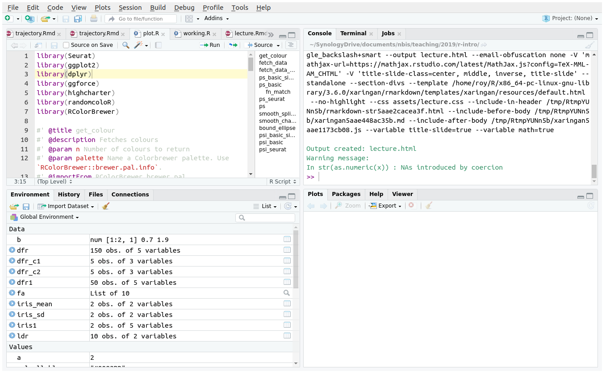
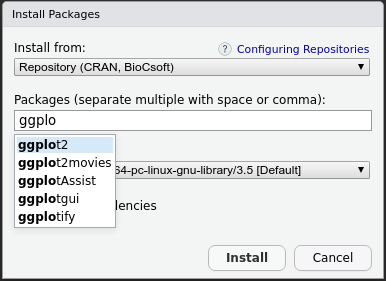

exclude: true
count: false

```{r,echo=FALSE,child="assets/header-slide.Rmd"}
```

---
name: contents
class: spaced

```{r,echo=FALSE,message=FALSE,warning=FALSE}
# load packages
library(ggplot2)
library(dplyr)
```

name: contents
class: spaced

## Contents

- [Getting Started](#install)
- [Variables & Operators](#basic-operators)
- [Data Types](#datatype-overview)
- [Datatype Conversion](#datatype-conversion)
- [Functions](#functions-built-in-math)
- [Control Structures](#control-structure-if)
- [R Packages](#package)
- [Base Graphics](#graphics-base-1)
- [Grid Graphics](#graphics-ggplot-0)
- [Input & Output](#io-text)
- [Rmarkdown](#rr-0)
- [Tidyverse](#tidyverse-1)
- [Bioconductor](#bioconductor)
- [Exercises/Lab](#lab)
- [Help & Learning R](#help)

---
name: topics
class: spaced

## Topics

- R & RStudio environment
- Running code, scripting, sourcing script
- Variables and operators
- Data types & data type conversion
- Reusing code using functions
- Base and grid graphics
- Input & output of text & graphics
- Reproducible analyses, Rmarkdown, notebooks and reports
- Tidyverse: Modern R programming paradigm

---
name: why-r

## What? Why R?

> R is a language and environment for statistical computing and graphics.

- Command line interface

.pull-left-50[
**Pros**

- Data analysis
- Statistics
- High quality graphics
- Huge number of packages
- R is popular
- Reproducible research
- RStudio IDE
- FREE! Open source

**Cons**

- Steep learning curve
- Not elegant/consistent
- Slow
]

.pull-right-50[
.size-60[]
]

???

R has a huge community of users. More than 10,000 packages are available for a diverse range of analyses.

---
name: install

## Installation

- Install R from [r-project.org](https://cloud.r-project.org/).
- Install [RStudio IDE](https://www.rstudio.com/products/rstudio/download/)
- Code editor, highlighting, projects, version control, package building, debugger, profiler

.size-90[.center[]]

???

Set up R to enable a comfortable working environment. For windows users, it is advisable to install to `C:/R/` rather than Program Files.

---
name: interact
class: spaced

## Interaction

- Execute commands directly in Console
- Ready console shows `>`
- Console shows `+` when waiting for information
- Press .kbd[Esc] to escape from `+` to `>`
- Save commands by writing scripts
- Run lines using .kbd[Ctrl]+.kbd[Enter]
- Run entire script using .kbd[Ctrl]+.kbd[Shift]+.kbd[Enter]

---
name: basic-operators

## Variables & Operators

.pull-left-50[
- Assign variables using `<-`, `=` or `->`

```{r}
x <- 4
x = 4
x
```

- Arithmetic operators

```{r}
x <- 4; y <- 2;
x + y # add
x - y # subtract
x * y # multiply
x / y # divide
x %% y # modulus
x ^ y # power
```
]

--

.pull-right-50[

- Logical operators return `TRUE` or `FALSE`

```{r}
x == y # equal to?
x != y # not equal to?
x > y # greater than?
x < y # less than?
x >= y # greater than or equal to?
x <= y # less than or equal to?
```

```{r}
T | F # OR
T & F # AND
```

- `||`, `&&`, `!`, `any()`, `all` for logical vectors

]

---
name: strings

## Variables & Operators

- `:` operator is used for generating regular sequences
- `::` & `:::` are used for accessing functions
- `%*%` used for matrix multiplication
- `%in%` used as a set operator

```{r}
"a" %in% c("x","p","a","c")
```

- Avoid conflicting built-in variable names like `c`, `t`, `q` etc
- Variable names cannot start with a number

---
name: datatype-overview

## Data Type • Overview

```{r,echo=FALSE}
data.frame(dimension=c("1D","2D","nD"),homogenous=c("Atomic vector","Matrix","Array"),heterogenous=c("List","Data.frame",""))
```

- Use `typeof()` to find type of a variable

```{r}
x <- 4; typeof(x)
```

```{r}
y <- "this"; typeof(y)
```

```{r}
mode(x); class(x)
str(x); structure(x)
```

---
name: datatype-basic

## Data Type • Basic

.pull-left-50[

- Mode

```{r}
mode(1.0)
mode(1L)
mode("hello")
mode(factor(1))
mode(T)
```
]

--

.pull-right-50[

- Type

```{r}
typeof(1.0)
typeof(1L)
typeof("hello")
typeof(factor(1))
typeof(T)
```
]

---
name: datatype-na

## Data Type • Missing Values

- R explicitly handles missing data as `NA` and undefined data as `NULL` ([NA vs NULL](https://www.r-bloggers.com/r-na-vs-null/))
- NA is not 0
- NA is not ""
- NA is not FALSE
- NA is not NULL
- Operations that involve NA may or may not result in an NA

```{r}
NA==1
sum(c(2,6,NA,6))
sum(c(2,6,NA,6),na.rm=TRUE)
NA|NA
NA|TRUE
NA&TRUE
NULL|TRUE
```

---
name: datatype-vector-create

## Data Type • Vector • Create

- Vector stores multiple values
- Concatenate variables, values and vectors using the function `c()`

```{r}
x <- c(2,3,4,5,6)
y <- c("a","c","d","e")
x
y
```

--

- Few different ways to create vectors.

```{r}
c(2,3,5,6)
2:8
seq(2,5,by=0.5)
rep(1:3,times=2)
```

---
name: datatype-vector-access

## Data Type • Vector • Access

- Access vectors using the `[]` operator.

```{r}
x[1]; y[3]
```

--

- Function `c()` to specify multiple positions.

```{r}
x[c(1,3)]
```

--

- Vectorised operation

```{r}
x <- c(2,3,4,5); y <- c(9,8,7,6)
x+y

z <- c("a","an","a","a"); k <- c("boy","apple","girl","mess")
paste(z,k)
```

---
name: datatype-vector-verify

## Data Type • Vector

- Verify data type

```{r}
x <- c(2,3,4,5)
z <- c("a","an","a","a")

mode(x)
mode(z)
str(x)
str(z)
```

```{r}
is.atomic(x)
is.numeric(x)
is.character(z)
```

---
name: datatype-factor

## Data Type • Factor

- Factors store categorical data

```{r}
x <- factor(c("a","b","b","c","c"))
class(x)
str(x)
```

- Factor `x` has 3 categories (3 levels)

```{r}
levels(x)
```

- Verify if an R object is a factor

```{r}
is.factor(x)
```

---
name: datatype-matrix-create

## Data Type • Matrix • Create

.pull-left-50[
- Create a matrix from vector

```{r}
x <- matrix(c(2,3,4,5,6,7))
x
```

- Matrix has rows and columns

```{r}
dim(x) # dimensions
nrow(x) # number of rows
ncol(x) # number of columns
```
]

.pull-right-50[
- Specify rows and columns

```{r}
x <- matrix(c(2,3,4,5,6,7),nrow=3,
            ncol=2,byrow=TRUE)
x
```

```{r}
str(x)
```

- Verify if an R object is a matrix

```{r}
is.matrix(x)
```
]

---
name: datatype-matrix-access

## Data Type • Matrix • Access

- Access matrix using `[]` operator as `[row,col]`

```{r}
x[2,2]
```

- Get whole row/col using `[row,]` or `[,col]`

```{r}
x[1,]
x[,2]
```

- Use `drop=FALSE` to retain a matrix as `[row,col,drop=FALSE]`

```{r}
x[1,,drop=F]
```

---
name: datatype-matrix-label

## Data Type • Matrix • Label

.pull-left-50[

- Add row/column names

```{r}
rownames(x) <- c("a","b","c")
colnames(x) <- c("k","p")
x
```

- Get row/column labels

```{r}
rownames(x)
colnames(x)
dimnames(x)
```
]

--

.pull-right-50[

- Access using labels

```{r}
x["b",]
x[,"p"]
```

]

---
name: datatype-list-create

## Data Type • List

.pull-left-50[

- Create using `list()`.

```{r}
x <- list(c(2,3,4,5),c("a","b","c","d"),
          factor(c("a","a","b")),
          matrix(c(3,2,3,5,6,7),ncol=2))
x
```

]

.pull-right-50[

```{r}
typeof(x); class(x);
```

- Access lists using `[]` and `[[]]`

```{r}
x[1]
```

- Lists are recursive

```{r}
x <- list(list(list(list())))
str(x)
```

]

---
name: dataframe-create

## Data Type • `data.frame` • Create

```{r}
dfr <- data.frame(x = 1:3, y = c("a", "b", "c")); dfr
```

```{r}
str(dfr)
```

- Use `stringsAsFactors=FALSE` to avoid auto factor conversion

```{r}
dfr <- data.frame(x = 1:3, y = c("a", "b", "c"), stringsAsFactors = F)
str(dfr)
is.data.frame(dfr)
```

---
name: dataframe-access

## Data Type • `data.frame` • Access

- Access using `[]` or `$` operator

```{r}
dfr$x
dfr$y
```

- `head()`/`tail()` functions show first/last six lines
- Subset a `data.frame` using `subset()`

```{r}
subset(dfr,dfr$y=="a")
```

---
name: datatype-conversion

## Data Type • Conversion

```{r}
x <- c(1,2,3); str(x)
```

- Convert to character

```{r}
y <- as.character(x); str(y)
```

- Character coerced (if possible) to number

```{r}
x <- c("1","2","hello"); str(x)
```

```{r}
str(as.numeric(x))
```

---
name: datatype-conversion-2

## Data Type • Conversion

Many other conversion functions

- `as.matrix()`
- `as.data.frame()`
- `as.integer()`
- `as.Date()`
- `as.factor()`
- `as.list()`
- `as.vector()`

---
name: functions-built-in-math

## Functions • Built-In • Math

```{r}
# generate 10 random numbers between 1 and 200
x <- sample(x=1:200,10); x;
```

```{r}
sum(x) # sum
mean(x) # mean
min(x) # min
log(x) # log
exp(x) # exponent
sqrt(x) # square-root
round(x) # round
sort(x) # sort
```

---
name: functions-built-in-string

## Functions • Built-In • String

```{r}
paste("hello","kitty") # join
grep("hell","hello") # find a pattern
nchar("hello") # number of characters
toupper("hello") # to uppercase
tolower("HELLO") # to lowercase
sub("ell","ipp","hello") # replace pattern
substr("hello",start=1,stop=3) # substring
strsplit("sunny&bunny&funny","&") # split a character
```

- `print()` & `cat()` are useful for printing messages
- `\n` newline character

---
name: functions-custom

## Functions • Custom

Code can be re-used by converting them to functions.

```{r}
a <- 1:6; b <- 8:10
d <- a*b
e <- log(d)
e
```

- Custom function definition

```{r}
my_function <- function(a,b){
  d <- a*b
  e <- log(d)
  return(e)
}
```

- Re-use function

```{r}
my_function(a=2:4,b=6:8)
```

- Function names must not start with number

???

If a chunk of code is copy-pasted in multiple places, it's time to create a function out it. When a code chunk is converted to a function, it is defined in one location and can be called from any other location. In addition, it is easier to maintain and update one chunk of code rather than multiple copies of it.

---
name: control-structure-if

## Control Structure • `if`

- Conditional statements using `if()`

```{r}
a <- 2; b <- 5;
if(a < b) print(paste(a,"is smaller than",b))
```

--

.pull-left-50[
- Use `else` for alternative output

```{r}
if(a < b) {
  print(paste(a,"is smaller than",b))
}else{
  print(paste(b,"is smaller than",a))
}
```
]

--

.pull-right-50[
- Chain `if else` statements

```{r}
grade <- "B"

if(grade == "A"){
  print("Grade is Excellent!")
}else if(grade == "B"){
  print("Grade is Good.")
} else if (grade == "C") {
  print("Grade is Alright.")
}
```
]

---
name: control-structure-for

## Control Structure • `for`

- Use `for()` loop for known number of iterations

```{r}
for (i in 1:5){
  print(i)
}
```

--

- Use `while()` loop for unknown number of iterations

```{r}
i <- 1
while(i < 5){
  print(i)
  i <- i+1
}
```

---
name: package

## R Packages

- [CRAN](https://cran.r-project.org/) (The Comprehensive R Archive Network); Use `install.packages()`

```{r,eval=FALSE}
install.packages("ggplot2",dependencies=TRUE)
```

- For local packages, use `type="source"`

```{r,eval=FALSE}
install.packages(path="./dir/package.zip",type="source")
```

--

.size-50[]

--

- [Bioconductor](https://www.bioconductor.org/) for Biology/Bioinformatics packages; Use `BiocManager::install()`
- For GitHub packages, Use `devtools::install_github()`

---
name: graphics

## Graphics


---
name: graphics-base-1

## Graphics • Base

```{r,dev='svg',fig.height=3.5,fig.width=7}
dfr <- data.frame(a=sample(1:100,10),b=sample(1:100,10))
plot(dfr$a,dfr$b)
```

--

- Add axes labels etc

```{r,dev='svg',eval=FALSE}
plot(dfr$a,dfr$b,xlab="Variable a",ylab="Variable b")
plot(dfr$a,dfr$b,xlab="Variable a",ylab="Variable b",type="b")
```

---
name: graphics-base-2

## Graphics • Base

```{r,dev='svg',fig.height=3.6,fig.width=7}
dfr$cat <- rep(c("C1","C2"),each=5) # add category

# subset data
dfr_c1 <- subset(dfr,dfr$cat == "C1")
dfr_c2 <- subset(dfr,dfr$cat == "C2")

plot(dfr_c1$a,dfr_c1$b,xlab="Variable a",ylab="Variable b",col="red",pch=1)
points(dfr_c2$a,dfr_c2$b,col="blue",pch=2)
legend(x="bottomright",legend=c("C1","C2"),
       col=c("red","blue"),pch=c(1,2))
```

---
name: graphics-base-3

## Graphics • Base

- Barplot

```{r,dev='svg',fig.height=4.5,fig.width=7}
ldr <- data.frame(a=letters[1:10],b=sample(1:50,10))
barplot(ldr$b,names.arg=ldr$a)
```

---
name: graphics-ggplot-0
background-image: url("images/ggplot2-exploratory.png")
background-size: cover

---
name: graphics-ggplot-1

## Graphics • `ggplot2`

```{r,dev='svg',fig.height=3.8,fig.width=7}
library(ggplot2)

ggplot(dfr,aes(x=a,y=b,colour=cat))+
  geom_point()+
  labs(x="Variable a",y="Variable b")
```

---
name: graphics-ggplot-2

## Graphics • `ggplot2`

- Barplot

```{r,dev='svg',fig.height=4,fig.width=7}
ggplot(ldr,aes(x=a,y=b))+
  geom_bar(stat="identity")
```

---
name: io-text

## Input & Output • Text

```{r,include=FALSE,eval=TRUE}
write.table(iris,"iris.txt",sep="\t",row.names=FALSE,quote=FALSE)
```

```{r}
dfr <- read.table("iris.txt",header=TRUE,stringsAsFactors=F)
head(dfr); str(dfr)
```

```{r}
dfr1 <- dfr[dfr$Species == "setosa",]
write.table(dfr1,"iris-setosa.txt",sep="\t",row.names=F,quote=F)
```

`sep="\t"` sets tab delimiter, `row.names=F` avoids printing rownames, `quote=F` avoids quotes around strings.

---
name: io-image

## Input & Output • Image

- Create data

```{r,eval=FALSE}
dfr <- data.frame(a=sample(1:100,10),b=sample(1:100,10))
```

- Base plot

```{r,eval=FALSE}
png(filename="plot-base.png")
plot(dfr$a,dfr$b)
dev.off()
```

- ggplot method 1

```{r,eval=FALSE}
p <- ggplot(dfr,aes(a,b)) + geom_point()

png(filename="plot-ggplot-1.png")
print(p)
dev.off()
```

- ggplot method 2

```{r,eval=FALSE}
ggsave(filename="plot-ggplot-2.png",plot=p)
```

---
name: io-robj

## R objects

* Save R objects as compressed native R formats

--
* Save/Read a single object as .Rds format

```{r,eval=FALSE}
dfr <- data.frame(a=sample(1:100,10),b=sample(1:100,10))
saveRDS(dfr,"data.Rds")
dfr <- readRDS("data.Rds")
```

--

* Save one or more objects as .Rda/.Rdata format

```{r,eval=FALSE}
save(dfr,"data.Rdata")
save(dfr,dfr2,"data.Rdata")
load("data.Rdata")
```

* Save entire workspace

```{r,eval=FALSE}
save.image(file="workspace.Rdata")
load("workspace.Rdata")
```

---
name: rr-0
background-image: url("images/rmarkdown-wizards.png")
background-size: cover

---
name: rr

## Reproducible Analyses

* Manually steps = poor reproducibility
* Rerunning analyses
* Adding new data
* Transferring projects
* Collaborative work
* Eliminate copy-paste errors

--

### Recommendations

* Single document with analyses, code and results
* Self-contained portable project
* Avoid manual steps
* Results are linked to code used to produce them
* Contexual narrative to workflow
* Version control of documents

---
name: r-workflow

## Reproducibility in R

* Manage R versions carefully  
* Install packages from repositories  

```
install.packages(); devtools::install_github(); BiocManager::install()
```

* Package management using `renv`
* Version control using git (RStudio integrated)
* RStudio (Syntax highlighting, Debugging, Projects etc)
* Running external programs from R

```
system("./plink --file --flag1 --flag2 --out bla")
```

---
name: docconvert

## Document Converter


* Document converter (Reports, Presentations, Articles etc)
* Rmd -> md -> HTML|PDF|docx

---
name: notebook

## RStudio Notebook

.small[**Create a new .Rmd document**]


* Text and code can be written together
* Inline R output (text and figures)

???

R Notebook demonstration.

---
name: rmd-1

## Rmarkdown Guide

* Plain text format for readability
* Support of pure language (HTML, Latex etc) for complex formatting
* Rmarkdown = Markdown + R chunks
* Create a file that ends in `.Rmd`
* Add YAML matter to top

```
  ---
  title: "This is a title"
  output:
    rmarkdown::html_document
  ---
```
* In RStudio `File > New File > R Markdown` opens up an Rmd template
* Render interactively using the **Knit** button .fancyimage[]
* Render using command `rmarkdown::render("report.Rmd")`

---
name: rmd-2

## Rmarkdown Guide


.pull-left-70[
```
### Heading 3
#### Heading 4

_italic text_  
__bold text__  
`code text`  
~~strikethrough~~  
2^10^  
2~10~  

- bullet point

Link to [this](somewhere.com)


```
]

.pull-right-30[

### Heading 3
#### Heading 4

*italic text*  
**bold text**  
`code text`  
~~strikethrough~~  
2<sup>10</sup>  
2<sub>10</sub>   

* bullet point

Link to [this](somewhere.com)

.size-60[]
]

---
name: rmd-3

## Rmarkdown Guide

* R code can be executed inline

Today's date is `` `r "\u0060r date()\u0060"` ``    
Today's date is `r date()`  


* R code can be executed in code chunks

```{r,echo=FALSE,class.output="r",comment=""}
cat("```{r}\ndate()\n```")
```

* By default shows input code and output result.

```{r}
date()
```

* Many arguments to [customise chunks](https://yihui.name/knitr/options/)
  * Set `eval=FALSE` to not evaluate a code chunk
  * Set `echo=FALSE` to hide input code
  * Set `results="hide"` to hide output

* [R Markdown reference](https://rmarkdown.rstudio.com/lesson-1.html)

---
name: tidyverse-1

## Tidyverse

.size-70[]

.larger[> "Language for solving data science challenges using R"]

* Collection of R packages that share underlying design and grammar
* Modern, consistent and optimised functions
* Additional features compared to base R
* New code structure using new operators (Eg: pipe `%>%`)
* Tidy data & tidy evaluation

---
name: tidyverse-2

## Tidyverse


---
name: tidyverse-3

## Tidyverse

* `magrittr`: Piping commands using `%>%`
* `tibble`: A better data.frame
* `readr`: Functions to import/export data
* `tidyr`: Data structuring: wide & long formats, splitting, fill missing values etc
* `dplyr`: Data selection, filtering, summarising, merging etc
* `lubridate`: Working with time
* `stringr`: Working with strings
* `forcats`: Working with factors
* `purrr`: Simpler control structures for programming
* `broom`: Model building
* `ggplot2`: Plotting

---
name: tidyverse-4

## Tidyverse • Examples

.pull-left-50[

**Tidyverse**

```{r,fig.height=3.6,fig.width=5}
iris %>%
  filter(Species!="setosa") %>%
  select(Species,Petal.Length) %>%
  group_by(Species) %>%
  summarise(mean=mean(Petal.Length),sd=sd(Petal.Length)) %>%
  mutate(ymin=mean-sd,ymax=mean+sd) %>%
  ggplot(aes(x=Species,y=mean,ymin=ymin,ymax=ymax))+
  geom_bar(stat="identity")+
  geom_errorbar(width=0.1)
```
]

.pull-right-50[

**Base R**

```{r,fig.height=3.6,fig.width=5}
iris_mean <- aggregate(Petal.Length~Species,data=subset(iris,Species!="setosa"),FUN=mean)
iris_sd <- aggregate(Petal.Length~Species,data=subset(iris,Species!="setosa"),FUN=sd)
iris1 <- merge(iris_mean,iris_sd,by="Species")
colnames(iris1) <- c("Species","mean","sd")
iris1$Species <- factor(iris1$Species)
iris1$ymin <- iris1$mean-iris1$sd
iris1$ymax <- iris1$mean+iris1$sd
{b <- barplot(iris1$mean,names.arg=iris1$Species,ylim=c(0,max(iris1$ymax)),xlab="Species",ylab="mean")
arrows(x0=b,y0=iris1$ymin,y1=iris1$ymax, length=0.1, angle=90, code=3)}
```
]

---
name: tidyverse-5

## Tidyverse • Examples

.pull-left-50[

**Tidyverse**

```{r,eval=FALSE}
# extract columns from a data.frame
select(iris, Species, Petal.Width)
select(iris, 5, 4)

# extract rows
filter(iris, Petal.Width > 0.5 & Species == "setosa")

# ordering a data.frame
arrange(iris, desc(Species), Petal.Width)

# add new computed variable
iris %>% mutate(cent=Petal.Length-mean(Petal.Length))

# grouped summarisation
iris %>% group_by(Species) %>% summarise(mean=mean(Petal.Length))
```

]

.pull-right-50[

**Base R**

```{r,eval=FALSE}
# extract columns from a data.frame
iris[, c("Species", "Petal.Width")]
iris[, c(5, 4)]

# extract rows
iris[iris$Petal.Width > 0.5 & iris$Species == "setosa", ]

# ordering a data.frame
iris[order(rev(iris$Species), iris$Petal.Width), ]

# add new computed variable
iris$cent <- iris$Petal.Length-mean(iris$Petal.Length)

# grouped summarisation
aggregate(Petal.Length~Species,data=iris,FUN=mean)
```

]

---
name: bioconductor

## Bioconductor

<a href="https://bioconductor.org/">

</a>

* NGS/Genomics/Biology related packages
* Package management using `BiocManager`
* Complex objects (Classes) to hold related objects
* Workflows for common tasks

---
name: lab
class: spaced

## Exercises

Hands-On practise material for the contents covered on this course is available here.

.large[[https://royfrancis.github.io/course-r/lab.html](https://royfrancis.github.io/course-r/)]

---
name: help
class: spaced
background-image: url("images/helpful-sign.png")
background-size: cover

## Help

- Use `?function` to get function documentation
- Use `??name` to search for a function
- Use `args(function)` to get the arguments to a function
- Go to the package CRAN page/webpage for vignettes
- GitHub repos of packages have useful info
- [R bloggers](https://www.r-bloggers.com/): Great blog to follow to keep updated with the latest in the R world as well as tutorials.
- [Stackoverflow](https://stackoverflow.com/): Online community to find solutions to your problems.

---
name: learning-r
class: spaced
background-image: url("images/learning.png")
background-size: cover

## Learning R

### Tutorials

- [Introduction to R](https://www.datacamp.com/courses/free-introduction-to-r): Tutorial by Datacamp with excellent tutorials.
- [R programming tutorial](https://www.youtube.com/watch?v=s3FozVfd7q4): Youtube video tutorial by Derek Banas.
- [R for data science](http://r4ds.had.co.nz/) Data science tutorial by Hadley wickham.
- [Data carpentry](https://datacarpentry.org/R-ecology-lesson/) Data carpentry R workshop (Medium-Advanced)

### Reference

- [R Cookbook](http://www.cookbook-r.com/): General purpose reference.
- [Quick R](https://www.statmethods.net/): General purpose reference.
- [Awesome R](https://awesome-r.com/): Curated list of useful R packages.
- [RStudio cheatsheets](https://www.rstudio.com/resources/cheatsheets/): Useful cheatsheets.
- [Advanced R](http://adv-r.had.co.nz) by Hadley Wickham (Medium-Advanced)

### Links

- [Tutorialspoint List](https://www.computerworld.com/article/2497464/business-intelligence/top-r-language-resources-to-improve-your-data-skills.html?page=2): Good list of resources.

---
name: end-slide
class: end-slide

# Thank you! Questions?

```{r, echo=FALSE,child="assets/footer-slide.Rmd"}
```

```{r,eval=FALSE,include=FALSE}
rmarkdown::render("lecture.Rmd")
#pagedown::chrome_print("lecture.html")
```
